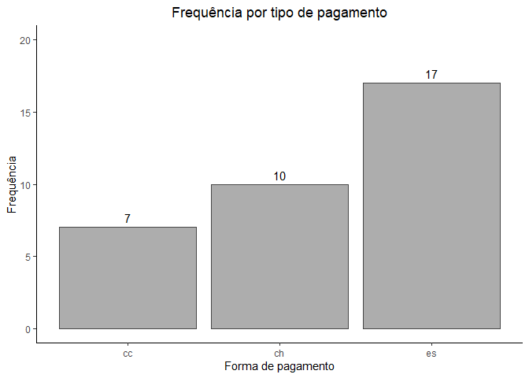
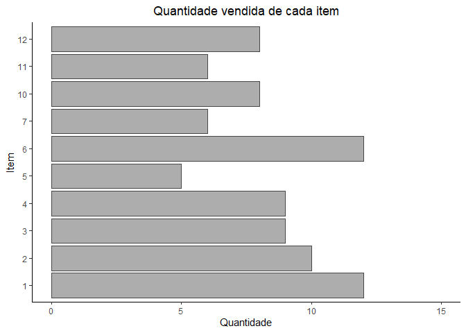
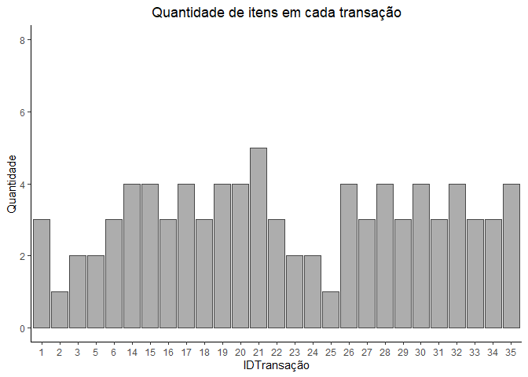
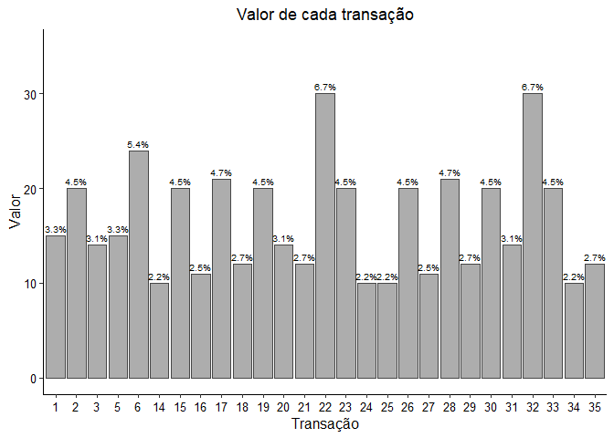
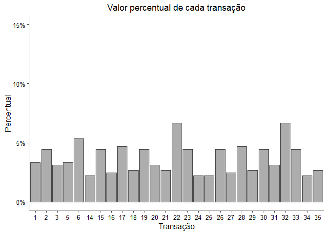
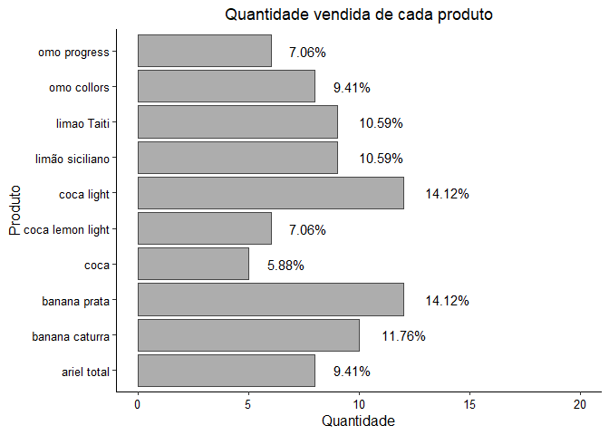
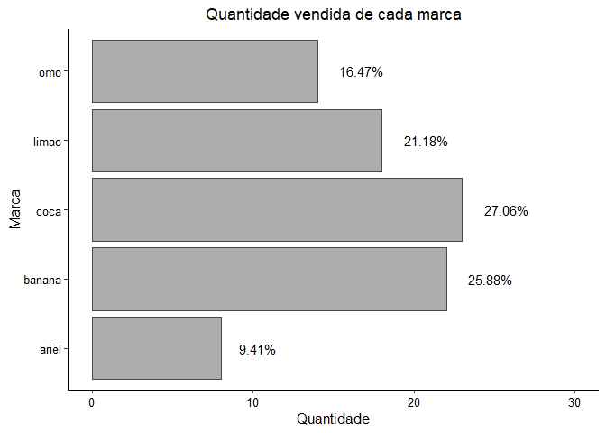
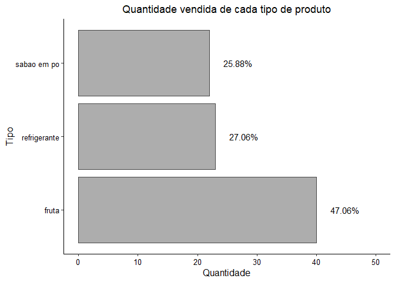
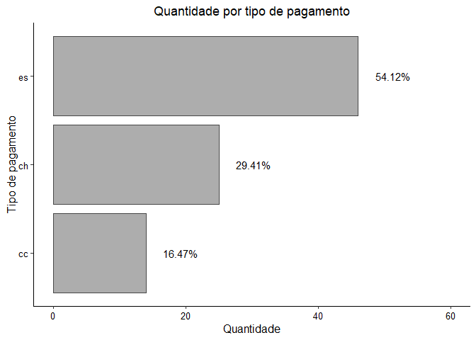

Regras de associação para produtos
================
Gleynner Ghiotto

-   [1 Carregamento das bases de
    dados](#1-carregamento-das-bases-de-dados)
-   [2 Examinar os conjuntos de
    dados](#2-examinar-os-conjuntos-de-dados)
    -   [2.1 Data frame “df_itens”](#21-data-frame-df_itens)
    -   [2.2 Data frame “df_transacoes”](#22-data-frame-df_transacoes)
    -   [2.3 Data frame
        “df_itemtransacao”](#23-data-frame-df_itemtransacao)
-   [3 União das bases de dados](#3-união-das-bases-de-dados)
    -   [3.1 Unir data frame “df_itemtransacao” com o data frame
        “df_itens”](#31-unir-data-frame-df_itemtransacao-com-o-data-frame-df_itens)
    -   [3.2 Unir data frame “df_TransItem” com o data frame
        “df_transacoes”](#32-unir-data-frame-df_transitem-com-o-data-frame-df_transacoes)
-   [4 Análise dos dados após a
    união](#4-análise-dos-dados-após-a-união)
    -   [4.1 Análise do valor por
        transações](#41-análise-do-valor-por-transações)
    -   [4.2 Análise por produto](#42-análise-por-produto)
    -   [4.3 Análise por marca](#43-análise-por-marca)
    -   [4.4 Análise por tipo](#44-análise-por-tipo)
    -   [4.5 Resumo por tipo de
        pagamento](#45-resumo-por-tipo-de-pagamento)
-   [5 Gerar regras de associação](#5-gerar-regras-de-associação)
    -   [5.1 Regras de associação para
        produtos](#51-regras-de-associação-para-produtos)
    -   [5.2 Regras de associação de
        marcas](#52-regras-de-associação-de-marcas)

# 1 Carregamento das bases de dados

-   Obter dados via Connectionstring do Access

``` r
# Connectionstring do Access
cs_access <- "Driver={Microsoft Access Driver (*.mdb, *.accdb)};DBQ= /Meu Drive/Dados_R/PORTFOLIO/Regras_de_associacao/compras.mdb"
# Mapeia conexão
con <- DBI::dbConnect(drv = odbc::odbc(),
                      .connection_string = cs_access,
                      encoding ="ISO-8859-1")
# Lista tabelas no banco
DBI::dbListTables(con)
```

     [1] "MSysAccessObjects"          "MSysAccessXML"             
     [3] "MSysACEs"                   "MSysNameMap"               
     [5] "MSysNavPaneGroupCategories" "MSysNavPaneGroups"         
     [7] "MSysNavPaneGroupToObjects"  "MSysNavPaneObjectIDs"      
     [9] "MSysObjects"                "MSysQueries"               
    [11] "MSysRelationships"          "itemtransacao"             
    [13] "itens"                      "transacoes"                
    [15] "itens Consulta"            

1.  itemtransacao

``` r
# Obtendo dados da base sem criterios
df_itemtransacao <- dplyr::tbl(con, "itemtransacao")
# Mostra consulta em SQL
#df_itemtransacao <- dplyr::show_query(df_itemtransacao)

# Converte dados em tibbla
df_itemtransacao <- dplyr::as_tibble(df_itemtransacao)
```

2.  itens

``` r
# Obtendo dados da base sem criterios
df_itens <- dplyr::tbl(con, "itens")
# Mostra consulta em SQL
# df_itens <- dplyr::show_query(df_itens)

# Converte dados em tibbla
df_itens <- dplyr::as_tibble(df_itens)
```

3.  transacoes

``` r
# Obtendo dados da base sem criterios
df_transacoes <- dplyr::tbl(con, "transacoes")
# Mostra consulta em SQL
# df_transacoes <- dplyr::show_query(df_transacoes)

# Converte dados em tibbla
df_transacoes <- dplyr::as_tibble(df_transacoes)
```

``` r
# Encerra a conexão e fecha o banco
odbc::dbDisconnect(con)
```

# 2 Examinar os conjuntos de dados

## 2.1 Data frame “df_itens”

-   Este data frame contem os códigos dos itens e suas respectivas
    descrições.

``` r
head(df_itens,n=10)
```

    # A tibble: 10 x 4
       codItem descrição        marca  tipo        
         <int> <chr>            <chr>  <chr>       
     1       1 banana prata     banana fruta       
     2       2 banana caturra   banana fruta       
     3       3 limao Taiti      limao  fruta       
     4       4 limão siciliano  limão  fruta       
     5       5 coca             coca   refrigerante
     6       6 coca light       coca   refrigerante
     7       7 coca lemon light coca   refirgerante
     8      10 omo collors      omo    sabao em po 
     9      11 omo progress     omo    sabao em po 
    10      12 ariel total      ariel  sabao em po 

``` r
names(df_itens)[colnames(df_itens) == "descrição"] <- "descricao"
```

``` r
unique(df_itens$codItem)
```

     [1]  1  2  3  4  5  6  7 10 11 12

``` r
unique(df_itens$descricao) 
```

     [1] "banana prata"     "banana caturra"   "limao Taiti"      "limão siciliano" 
     [5] "coca"             "coca light"       "coca lemon light" "omo collors"     
     [9] "omo progress"     "ariel total"     

``` r
unique(df_itens$marca)
```

    [1] "banana" "limao"  "limão"  "coca"   "omo"    "ariel" 

``` r
df_itens$marca[df_itens$marca == "limão"] <- "limao"

unique(df_itens$tipo)
```

    [1] "fruta"        "refrigerante" "refirgerante" "sabao em po" 

``` r
df_itens$tipo[df_itens$tipo == "refirgerante"] <- "refrigerante"
```

``` r
# Exibir resumo 
my_summary(df_itens)
```

       Variavel      Tipo  N Missing Missing_Percent N_unique
    1   codItem   integer 10       0               0       10
    2 descricao character 10       0               0       10
    3     marca character 10       0               0        5
    4      tipo character 10       0               0        3

## 2.2 Data frame “df_transacoes”

-   Este data frame contém o identificador de cada transação, com seu
    respectivo valor e forma de pagamento.

``` r
head(df_transacoes)
```

    # A tibble: 6 x 3
      IDTransação valorTotal `tipo pagamento`
            <int>      <int> <chr>           
    1           1         15 ch              
    2           2         20 ch              
    3           3         14 es              
    4           4         19 ch              
    5           5         15 es              
    6           6         24 cc              

``` r
colnames(df_transacoes) <- c("IDTransacao","valorTotal","tipoPagamento")
```

``` r
# Exibir resumo
my_summary(df_transacoes)
```

           Variavel      Tipo  N Missing Missing_Percent N_unique
    1   IDTransacao   integer 34       0               0       34
    2    valorTotal   integer 34       0               0       13
    3 tipoPagamento character 34       0               0        3

``` r
unique(df_transacoes$IDTransacao) %>% length()  # não existe informação da transação 13
```

    [1] 34

``` r
summary(df_transacoes$valorTotal)
```

       Min. 1st Qu.  Median    Mean 3rd Qu.    Max. 
      10.00   12.00   16.50   16.91   20.00   30.00 

``` r
ggplot(data = as.data.frame(table(df_transacoes$tipoPagamento))) +
  geom_col(aes(x=Var1,y=Freq), color = "grey28", fill = "grey68") +
  labs(x= "Forma de pagamento",y= "Frequência",title = "Frequência por tipo de pagamento")  +
  theme_classic() + theme(plot.title = element_text(hjust = 0.5)) +
  geom_text(aes(x=Var1,y=Freq,label=Freq),vjust = -0.5) +
  scale_y_continuous(limits = c(0,20))
```

<!-- -->

## 2.3 Data frame “df_itemtransacao”

-   Neste conjunto de dados foi mostrado o identificador de cada
    transação e os respectivos itens incluídos em cada uma delas.

``` r
head(df_itemtransacao)
```

    # A tibble: 6 x 2
      IDTransação  item
            <int> <int>
    1          14     1
    2          14     3
    3          14     6
    4          15     1
    5          15     3
    6          15     6

``` r
colnames(df_itemtransacao) <- c("IDTransacao","item")
```

``` r
my_summary(df_itemtransacao)
```

         Variavel    Tipo  N Missing Missing_Percent N_unique
    1 IDTransacao integer 85       0               0       27
    2        item integer 85       0               0       10

``` r
ggplot(data = as.data.frame(table(df_itemtransacao$item))) +
  geom_col(aes(x=Var1,y=Freq), color = "grey28", fill = "grey68") +
  labs(x= "Item",y= "Quantidade",title = "Quantidade vendida de cada item")  +
  theme_classic() + theme(plot.title = element_text(hjust = 0.5))   +
  scale_y_continuous(limits = c(0,15)) + coord_flip()
```

<!-- -->

``` r
ggplot(data = as.data.frame(table(df_itemtransacao$IDTransacao))) +
  geom_col(aes(x=Var1,y=Freq), color = "grey28", fill = "grey68") +
  labs(x= "IDTransação",y= "Quantidade",title = "Quantidade de itens em cada transação")  +
  theme_classic() + theme(plot.title = element_text(hjust = 0.5)) +
  scale_y_continuous(limits = c(0,8))
```

<!-- -->

# 3 União das bases de dados

## 3.1 Unir data frame “df_itemtransacao” com o data frame “df_itens”

``` r
df_TransItem <- left_join(df_itemtransacao,df_itens,by = c("item" = "codItem")) %>% group_by()
```

## 3.2 Unir data frame “df_TransItem” com o data frame “df_transacoes”

``` r
df_TransItemFull <- left_join(df_TransItem,df_transacoes,by = c("IDTransacao"))  %>% group_by(IDTransacao) %>% arrange(IDTransacao,item,.by_group = T)

head(df_TransItemFull,10)
```

    # A tibble: 10 x 7
    # Groups:   IDTransacao [5]
       IDTransacao  item descricao       marca  tipo        valorTotal tipoPagamento
             <int> <int> <chr>           <chr>  <chr>            <int> <chr>        
     1           1     1 banana prata    banana fruta               15 ch           
     2           1     4 limão siciliano limao  fruta               15 ch           
     3           1    12 ariel total     ariel  sabao em po         15 ch           
     4           2    12 ariel total     ariel  sabao em po         20 ch           
     5           3     2 banana caturra  banana fruta               14 es           
     6           3    12 ariel total     ariel  sabao em po         14 es           
     7           5     2 banana caturra  banana fruta               15 es           
     8           5     5 coca            coca   refrigeran~         15 es           
     9           6     1 banana prata    banana fruta               24 cc           
    10           6     3 limao Taiti     limao  fruta               24 cc           

# 4 Análise dos dados após a união

## 4.1 Análise do valor por transações

``` r
resumo_Transacao <- df_TransItemFull %>% 
  group_by(IDTransacao) %>% 
  summarise(count = n(),valorTransacao = sum(valorTotal)/count) %>% 
  mutate(perc_valorTransacao = (valorTransacao/sum(valorTransacao))*100,
         perc_lab = paste0(round(perc_valorTransacao,1),"%"))
```

``` r
resumo_Transacao$IDTransacao <- as.factor(resumo_Transacao$IDTransacao)

ggplot(data = resumo_Transacao) +
  geom_col(aes(x = IDTransacao,y = valorTransacao), color = "grey28", fill = "grey68") +
  labs(x = "Transação" , y = "Valor", title =  "Valor de cada transação") +
  scale_fill_discrete("") +
  theme_classic() +
  theme(plot.title = element_text(hjust = 0.5),
        axis.title.y = element_text(angle = 90, size = 12, vjust = 0.5),
        axis.title.x = element_text(size = 12),
        axis.text.y = element_text(size = 10,colour = "black"), 
        axis.text.x = element_text(size = 10,colour = "black"))  +
  scale_y_continuous(limits = c(0,35)) +
  geom_text(aes(x=IDTransacao,y=valorTransacao,label=perc_lab),size =2.6, vjust=-0.5,hjust=0.5)
```

<!-- -->

``` r
ggplot(data = resumo_Transacao) +
  geom_col(aes(x = IDTransacao, y = perc_valorTransacao), color = "grey28", fill = "grey68") +
  labs(x = "Transação", y = "Percentual", title =  "Valor percentual de cada transação") +
  scale_fill_discrete("") +
  theme_classic() +
  theme(plot.title = element_text(hjust = 0.5),
        axis.title.y = element_text(angle = 90, size = 12, vjust = 0.5),
        axis.title.x = element_text(size = 12),
        axis.text.y = element_text(size = 10,colour = "black"), 
        axis.text.x = element_text(size = 10,colour = "black"))  +
  scale_y_continuous(limits = c(0,15),labels = scales::percent_format(scale = 1,accuracy =5L))
```

<!-- -->

## 4.2 Análise por produto

``` r
resumo_Produto <- df_TransItemFull %>% 
  group_by(descricao) %>% 
  summarise(count = n()) %>% 
  mutate(perc_Produto = round((count/sum(count))*100,2),
         perc_label =  paste0(perc_Produto,"%")) 
```

``` r
resumo_Produto$descricao <- as.factor(resumo_Produto$descricao)

ggplot(data = resumo_Produto) +
  geom_col(aes(x = count,y = descricao), color = "grey28", fill = "grey68") +
  labs(x = "Quantidade", y = "Produto", title =  "Quantidade vendida de cada produto") +
  theme_classic() +
  theme(plot.title = element_text(hjust = 0.5),
        axis.title.y = element_text(angle = 90, size = 12, vjust = 0.5),
        axis.title.x = element_text(size = 12),
        axis.text.y = element_text(size = 10,colour = "black"), 
        axis.text.x = element_text(size = 10,colour = "black")) + 
  scale_x_continuous(limits = c(0,20)) +
  geom_text(aes(x = count,y = descricao,label = perc_label), vjust=0.5,hjust=-0.5)
```

<!-- -->

## 4.3 Análise por marca

``` r
resumo_Marca <- df_TransItemFull %>% 
  group_by(marca) %>% 
  summarise(count = n()) %>% 
  mutate(perc_marca = round((count/sum(count))*100,2),
         perc_label =  paste0(perc_marca,"%")) 
```

``` r
resumo_Marca$marca <- as.factor(resumo_Marca$marca)

ggplot(data = resumo_Marca) +
  geom_col(aes(x = count,y = marca), color = "grey28", fill = "grey68") +
  labs(x = "Quantidade", y = "Marca", title =  "Quantidade vendida de cada marca") +
  scale_fill_discrete("") +
  theme_classic() +
  theme(plot.title = element_text(hjust = 0.5),
        axis.title.y = element_text(angle = 90, size = 12, vjust = 0.5),
        axis.title.x = element_text(size = 12),
        axis.text.y = element_text(size = 10,colour = "black"), 
        axis.text.x = element_text(size = 10,colour = "black")) + 
  scale_x_continuous(limits = c(0,30)) +
  geom_text(aes(x = count,y = marca,label = perc_label), vjust=0.5,hjust=-0.5)
```

<!-- -->

## 4.4 Análise por tipo

``` r
resumo_Tipo <- df_TransItemFull %>% 
  group_by(tipo) %>% 
  summarise(count = n()) %>% 
  mutate(perc_tipo = round((count/sum(count))*100,2),
         perc_label =  paste0(perc_tipo,"%")) 
```

``` r
resumo_Tipo$tipo <- as.factor(resumo_Tipo$tipo)

ggplot(data = resumo_Tipo) +
  geom_col(aes(x = count,y = tipo), color = "grey28", fill = "grey68") +
  labs(x = "Quantidade", y = "Tipo", title =  "Quantidade vendida de cada tipo de produto") +
  scale_fill_discrete("") +
  theme_classic() +
  theme(plot.title = element_text(hjust = 0.5),
        axis.title.y = element_text(angle = 90, size = 12, vjust = 0.5),
        axis.title.x = element_text(size = 12),
        axis.text.y = element_text(size = 10,colour = "black"), 
        axis.text.x = element_text(size = 10,colour = "black"))  +
  scale_x_continuous(limits = c(0,50)) +
  geom_text(aes(x = count,y = tipo,label = perc_label), vjust=0.5,hjust=-0.5)
```

<!-- -->

## 4.5 Resumo por tipo de pagamento

``` r
resumo_TipoPG <- df_TransItemFull %>% 
  group_by(tipoPagamento) %>% 
  summarise(count = n()) %>% 
  mutate(perc_tipoPG = round((count/sum(count))*100,2),
         perc_label =  paste0(perc_tipoPG,"%")) 
```

``` r
resumo_TipoPG$tipoPagamento <- as.factor(resumo_TipoPG$tipoPagamento)

ggplot(data = resumo_TipoPG) +
  geom_col(aes(x = tipoPagamento,y = count), color = "grey28", fill = "grey68") +
  labs(x = "Tipo de pagamento" , y = "Quantidade", title =  "Quantidade por tipo de pagamento") +
  theme_classic() +
  theme(plot.title = element_text(hjust = 0.5),
        axis.title.y = element_text(angle = 90, size = 12, vjust = 0.5),
        axis.title.x = element_text(size = 12),
        axis.text.y = element_text(size = 10,colour = "black"), 
        axis.text.x = element_text(size = 10,colour = "black"))  +
  scale_y_continuous(limits = c(0,60))  +
  geom_text(aes(x = tipoPagamento,y = count,label = perc_label), vjust=0.5,hjust=-0.5) +
  coord_flip()
```

<!-- -->

# 5 Gerar regras de associação

## 5.1 Regras de associação para produtos

``` r
# Modelar e tratar tabela de associação de produtos e executar função "apriori"
associarProduto <- df_TransItemFull[,c(1,3)] %>% dcast(IDTransacao ~ descricao, value.var = "descricao")
associarProduto1 <- substituirNome(associarProduto)

# Gerar regras deassociação
regrasProduto <- apriori(data = associarProduto1[,-1], parameter = list(support = 0.1, confidence = 0.7));regrasProduto
```

    Apriori

    Parameter specification:
     confidence minval smax arem  aval originalSupport maxtime support minlen
            0.7    0.1    1 none FALSE            TRUE       5     0.1      1
     maxlen target  ext
         10  rules TRUE

    Algorithmic control:
     filter tree heap memopt load sort verbose
        0.1 TRUE TRUE  FALSE TRUE    2    TRUE

    Absolute minimum support count: 2 

    set item appearances ...[0 item(s)] done [0.00s].
    set transactions ...[10 item(s), 27 transaction(s)] done [0.00s].
    sorting and recoding items ... [10 item(s)] done [0.00s].
    creating transaction tree ... done [0.00s].
    checking subsets of size 1 2 3 done [0.00s].
    writing ... [8 rule(s)] done [0.00s].
    creating S4 object  ... done [0.00s].

    set of 8 rules 

``` r
r <- inspect(sort(regrasProduto, by = 'lift'))
```

        lhs                                     rhs                 support  
    [1] {coca light=1,limao Taiti=1}         => {omo progress=1}    0.1111111
    [2] {banana caturra=1,coca light=1}      => {limão siciliano=1} 0.1481481
    [3] {coca light=1,limão siciliano=1}     => {banana caturra=1}  0.1481481
    [4] {limao Taiti=1,omo progress=1}       => {coca light=1}      0.1111111
    [5] {banana caturra=1,limão siciliano=1} => {coca light=1}      0.1481481
    [6] {omo progress=1}                     => {coca light=1}      0.1851852
    [7] {banana prata=1,limao Taiti=1}       => {coca light=1}      0.1111111
    [8] {coca light=1,limao Taiti=1}         => {banana prata=1}    0.1111111
        confidence coverage  lift   count
    [1] 0.7500000  0.1481481 3.3750 3    
    [2] 1.0000000  0.1481481 3.0000 4    
    [3] 1.0000000  0.1481481 2.7000 4    
    [4] 1.0000000  0.1111111 2.2500 3    
    [5] 1.0000000  0.1481481 2.2500 4    
    [6] 0.8333333  0.2222222 1.8750 5    
    [7] 0.7500000  0.1481481 1.6875 3    
    [8] 0.7500000  0.1481481 1.6875 3    

``` r
regras <- data.frame(SE = r$lhs, ENTAO = r$rhs, 
                     Suporte = paste0(round(r$support*100,2),"%"), 
                     Confianca = paste0(round(r$confidence*100,2),"%"), 
                     Lift = r$lift); regras
```

                                        SE               ENTAO Suporte Confianca
    1         {coca light=1,limao Taiti=1}    {omo progress=1}  11.11%       75%
    2      {banana caturra=1,coca light=1} {limão siciliano=1}  14.81%      100%
    3     {coca light=1,limão siciliano=1}  {banana caturra=1}  14.81%      100%
    4       {limao Taiti=1,omo progress=1}      {coca light=1}  11.11%      100%
    5 {banana caturra=1,limão siciliano=1}      {coca light=1}  14.81%      100%
    6                     {omo progress=1}      {coca light=1}  18.52%    83.33%
    7       {banana prata=1,limao Taiti=1}      {coca light=1}  11.11%       75%
    8         {coca light=1,limao Taiti=1}    {banana prata=1}  11.11%       75%
        Lift
    1 3.3750
    2 3.0000
    3 2.7000
    4 2.2500
    5 2.2500
    6 1.8750
    7 1.6875
    8 1.6875

## 5.2 Regras de associação de marcas

``` r
# Tratar tabela de associação de marcas para executar algoritmo "apriori"
associarMarca <- df_TransItemFull[,c(1,4)] %>% distinct() %>% spread(key = marca, value = marca)
associarMarca1 <- substituirNome(associarMarca)

# Gerar regras deassociação
regrasMarca <- apriori(data = associarMarca1[,-1], parameter = list(support = 0.30, confidence = 0.80))
```

    Apriori

    Parameter specification:
     confidence minval smax arem  aval originalSupport maxtime support minlen
            0.8    0.1    1 none FALSE            TRUE       5     0.3      1
     maxlen target  ext
         10  rules TRUE

    Algorithmic control:
     filter tree heap memopt load sort verbose
        0.1 TRUE TRUE  FALSE TRUE    2    TRUE

    Absolute minimum support count: 8 

    set item appearances ...[0 item(s)] done [0.00s].
    set transactions ...[5 item(s), 27 transaction(s)] done [0.00s].
    sorting and recoding items ... [4 item(s)] done [0.00s].
    creating transaction tree ... done [0.00s].
    checking subsets of size 1 2 3 done [0.00s].
    writing ... [12 rule(s)] done [0.00s].
    creating S4 object  ... done [0.00s].

``` r
r <- inspect(sort(regrasMarca, by = 'lift'))
```

         lhs                   rhs        support   confidence coverage  lift    
    [1]  {banana=1,coca=1}  => {limao=1}  0.5555556 0.8333333  0.6666667 1.250000
    [2]  {omo=1}            => {coca=1}   0.5185185 1.0000000  0.5185185 1.227273
    [3]  {limao=1,omo=1}    => {coca=1}   0.3333333 1.0000000  0.3333333 1.227273
    [4]  {banana=1,omo=1}   => {coca=1}   0.3703704 1.0000000  0.3703704 1.227273
    [5]  {limao=1}          => {banana=1} 0.6296296 0.9444444  0.6666667 1.159091
    [6]  {coca=1,limao=1}   => {banana=1} 0.5555556 0.9375000  0.5925926 1.150568
    [7]  {limao=1}          => {coca=1}   0.5925926 0.8888889  0.6666667 1.090909
    [8]  {banana=1,limao=1} => {coca=1}   0.5555556 0.8823529  0.6296296 1.082888
    [9]  {banana=1}         => {coca=1}   0.6666667 0.8181818  0.8148148 1.004132
    [10] {coca=1}           => {banana=1} 0.6666667 0.8181818  0.8148148 1.004132
    [11] {}                 => {banana=1} 0.8148148 0.8148148  1.0000000 1.000000
    [12] {}                 => {coca=1}   0.8148148 0.8148148  1.0000000 1.000000
         count
    [1]  15   
    [2]  14   
    [3]   9   
    [4]  10   
    [5]  17   
    [6]  15   
    [7]  16   
    [8]  15   
    [9]  18   
    [10] 18   
    [11] 22   
    [12] 22   

``` r
regras <- data.frame(SE = r$lhs, ENTAO = r$rhs, 
                     Suporte = paste0(round(r$support*100,2),"%"), 
                     Confianca = paste0(round(r$confidence*100,2),"%"), 
                     Lift = r$lift); regras
```

                       SE      ENTAO Suporte Confianca     Lift
    1   {banana=1,coca=1}  {limao=1}  55.56%    83.33% 1.250000
    2             {omo=1}   {coca=1}  51.85%      100% 1.227273
    3     {limao=1,omo=1}   {coca=1}  33.33%      100% 1.227273
    4    {banana=1,omo=1}   {coca=1}  37.04%      100% 1.227273
    5           {limao=1} {banana=1}  62.96%    94.44% 1.159091
    6    {coca=1,limao=1} {banana=1}  55.56%    93.75% 1.150568
    7           {limao=1}   {coca=1}  59.26%    88.89% 1.090909
    8  {banana=1,limao=1}   {coca=1}  55.56%    88.24% 1.082888
    9          {banana=1}   {coca=1}  66.67%    81.82% 1.004132
    10           {coca=1} {banana=1}  66.67%    81.82% 1.004132
    11                 {} {banana=1}  81.48%    81.48% 1.000000
    12                 {}   {coca=1}  81.48%    81.48% 1.000000
